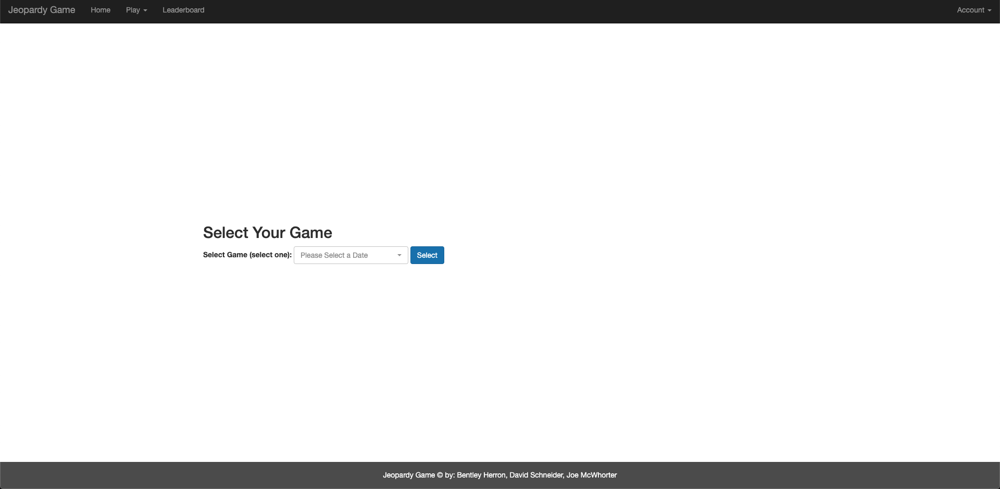
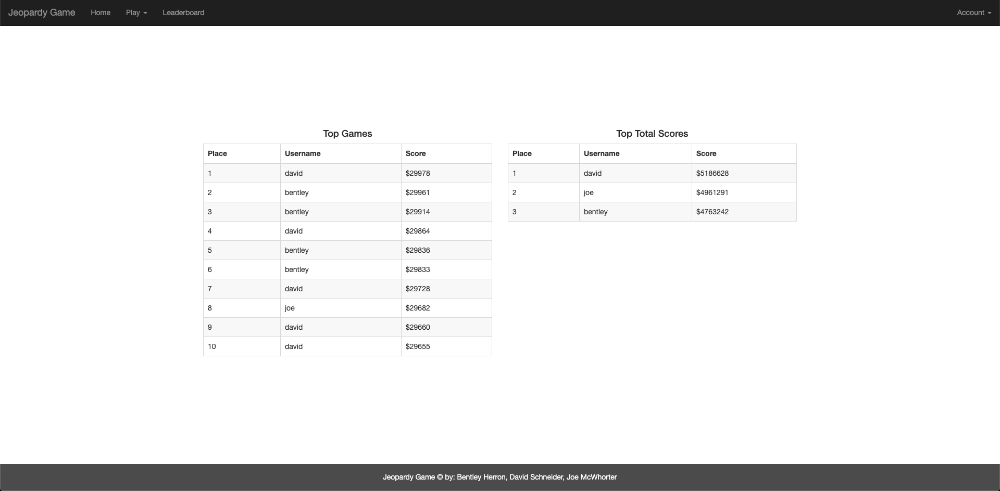

# Jeopardy Back-End Project ([Link](https://jeopardy.bentleyherron.dev))

# Screenshots

## Homepage and Rules

## Select Game Page

## Desktop Gameboard

## User Profile

## Leaderboard

# Problems Solved By Application

* Jeopardy is an entertainment application that allows users to select from an archive of past games or play randomly-selected games. 

* The application successfully combines a historical Jeopardy games API, front-end game interface and back-end functionality (user signup, password encryption, score logging and statistics).

# API Utilized

* [Jeopardy Archive](https://jeopardy-api.bentleyherron.dev)

# Future Features

* Multiple Players - allowing both local and remote users to play together on a single game.
* Tiebreak Page - in the (rare) event of a tie after Final Jeopardy.
* Historical Leaderboard - allowing users to compare their prowess to that of past, real-life Jeopardy contestants.

# Team Members

* Bentley Herron
* Joe McWhorter
* David Schneider
